# Evidencia de Pruebas — Pokédex API

Pruebas realizadas con Thunder Client contra `http://127.0.0.1:3000`.

---

## 1. GET /
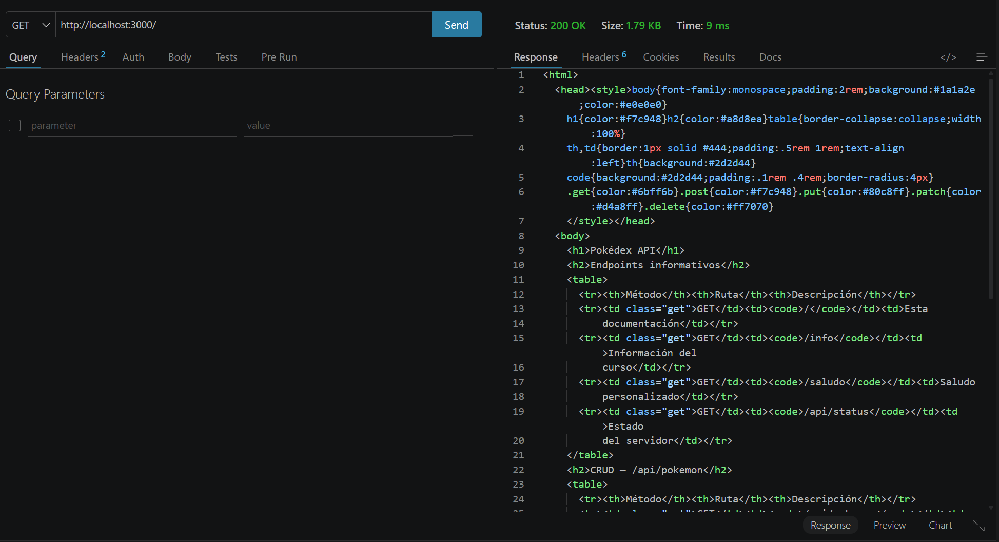
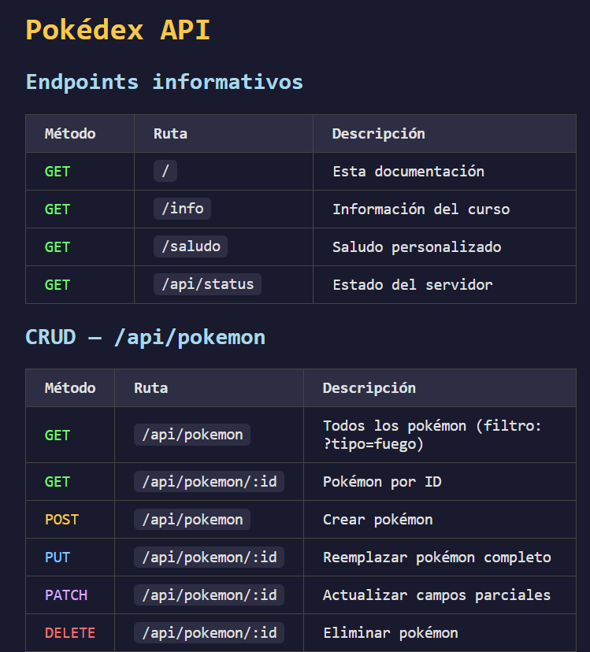

---

## 2. GET /info
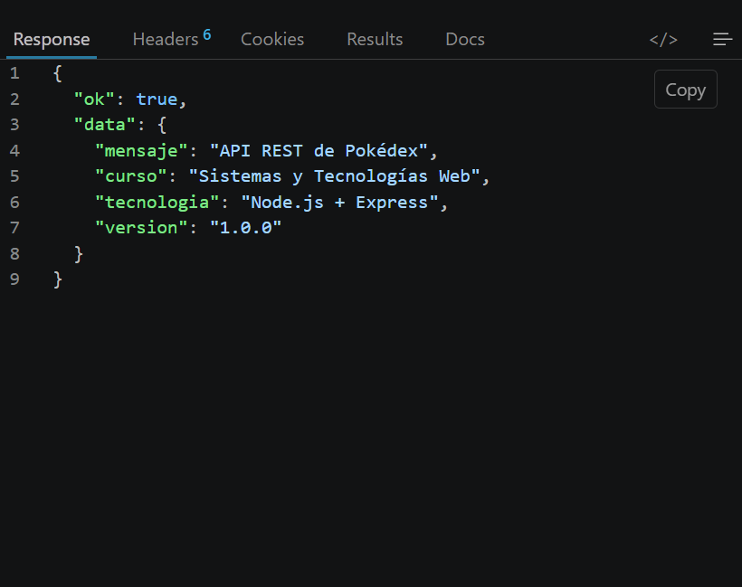

---

## 3. GET /saludo
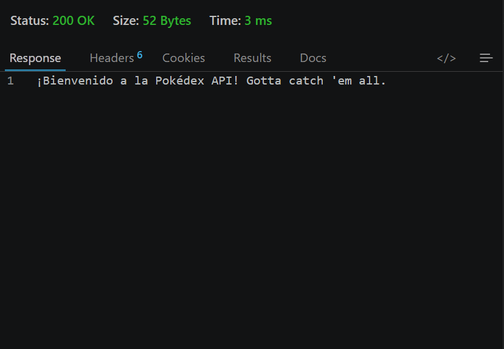

---

## 4. GET /api/status
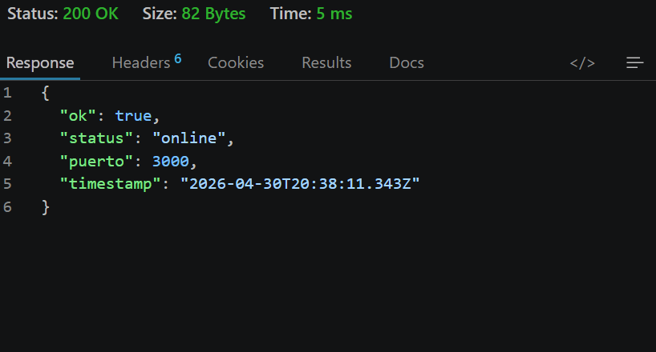

---

## 5. GET /api/pokemon
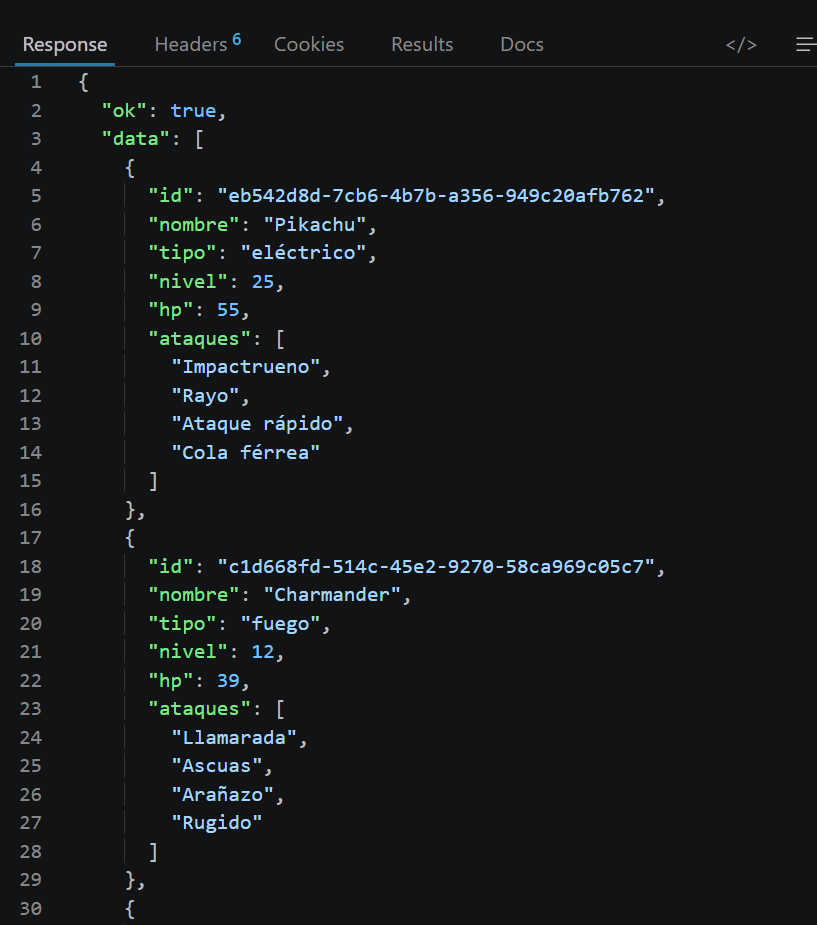
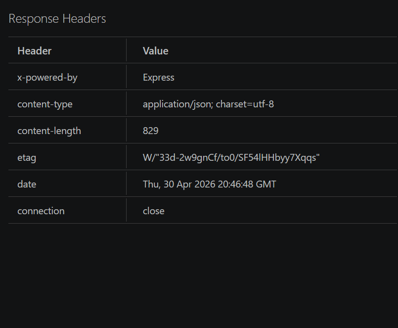

---

## 6. POST /api/pokemon — creación exitosa (201)
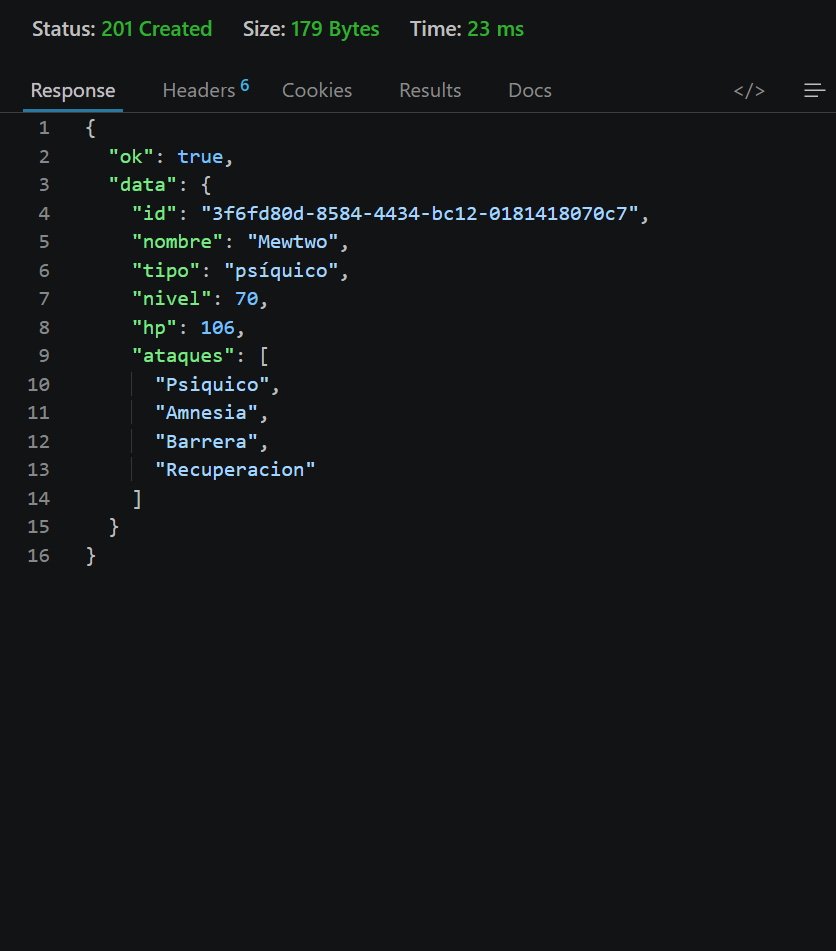
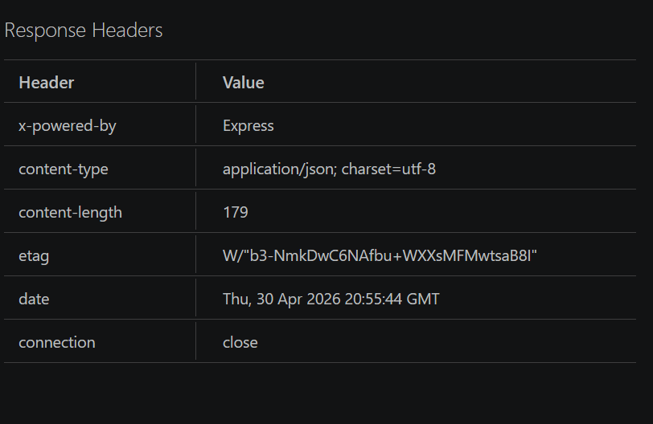

---

## 7. GET /api/pokemon/:id
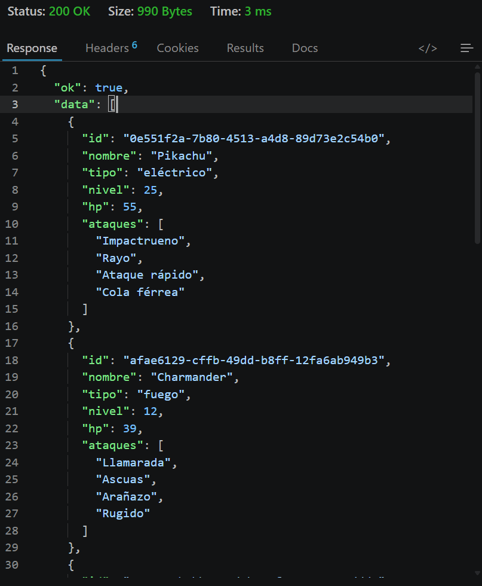
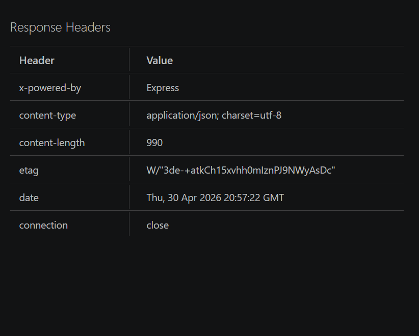
